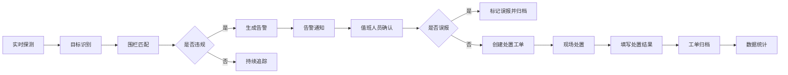

## 1. 产品概述

无人机黑飞检测 Web 应用，为园区安保和低空监管人员提供日常值守平台，实现对低空空域的实时监控、异常目标检测、告警处置和数据统计分析。

- 核心目标：通过多源探测设备融合，实时发现并追踪"黑飞"无人机，辅助监管人员快速处置
- 目标用户：园区安保人员、低空监管执法人员、值班指挥员
- 核心价值：提升低空安全管控效率，缩短告警响应时间，留存完整处置台账

## 2. 核心特性

### 2.1 用户角色

| 角色 | 注册方式 | 核心权限 |
|------|----------|----------|
| 值班人员 | 系统账号登录 | 实时监控、告警确认、工单处置 |
| 管理员 | 系统账号登录 | 全部功能、设备管理、围栏配置、报告导出 |

### 2.2 功能模块

1. **态势大屏**：空域边界展示、雷达/遥测点位标记、疑似目标实时轨迹、告警等级可视化
2. **告警列表**：多维度筛选、告警确认、误报标记、升级处置
3. **目标详情**：飞行高度/速度/方向展示、出现时间记录、相似历史目标匹配
4. **电子围栏**：禁飞区绘制、限高区设置、临时管控区管理
5. **处置工单**：联系人记录、现场核查、喊话驱离、拦截处置、结果归档
6. **设备管理**：探测器在线状态、覆盖范围展示、故障提醒
7. **统计报表**：按区域/时段/类型汇总趋势、值班报告导出

### 2.3 页面详情

| 页面名称 | 模块名称 | 功能描述 |
|---------|---------|----------|
| 态势大屏 | 地图主视图 | 2D地图展示园区范围、空域边界、设备位置 |
| 态势大屏 | 目标轨迹层 | 实时绘制无人机飞行轨迹，动态更新位置 |
| 态势大屏 | 告警状态面板 | 顶部显示当前告警数、各等级告警统计、设备在线率 |
| 态势大屏 | 实时告警滚动条 | 底部轮播最新告警信息 |
| 告警列表 | 筛选区 | 按时间、等级、状态、区域多条件筛选 |
| 告警列表 | 数据表格 | 显示告警时间、目标ID、位置、等级、状态、操作 |
| 告警列表 | 批量操作 | 批量确认、批量标记误报 |
| 目标详情 | 基础信息卡 | 目标ID、类型、首次发现时间、持续时长 |
| 目标详情 | 飞行参数 | 高度、速度、航向、经纬度实时数值 |
| 目标详情 | 历史相似 | 展示历史上相似飞行特征的目标记录 |
| 目标详情 | 轨迹回放 | 支持历史轨迹时间轴回放 |
| 电子围栏 | 地图绘制 | 多边形绘制禁飞区、圆形限高区、矩形管控区 |
| 电子围栏 | 围栏列表 | 显示所有已配置围栏的名称、类型、有效期 |
| 电子围栏 | 属性编辑 | 设置围栏高度限制、生效时间、告警等级 |
| 处置工单 | 工单列表 | 待处置、处置中、已完结工单分类展示 |
| 处置工单 | 工单详情 | 联系人信息、处置措施记录（核查/喊话/拦截）、结果反馈 |
| 处置工单 | 新建工单 | 关联告警、指派人员、填写处置措施 |
| 设备管理 | 设备概览 | 在线/离线/故障设备数量统计卡片 |
| 设备管理 | 设备列表 | 设备名称、类型、位置、状态、覆盖半径、最后心跳 |
| 设备管理 | 覆盖可视化 | 地图上绘制各设备探测覆盖范围 |
| 统计报表 | 趋势图表 | 按日/周/月展示告警趋势折线图 |
| 统计报表 | 分类统计 | 按区域、时段、目标类型的饼图/柱状图统计 |
| 统计报表 | 报告导出 | 生成并导出PDF/Excel格式值班报告 |

## 3. 核心流程

1. 系统通过多源探测设备实时扫描低空空域
2. 识别到飞行目标后，自动匹配电子围栏规则
3. 违规目标触发告警，通知值班人员
4. 值班人员确认告警，排除误报后创建处置工单
5. 指派人员现场处置，记录喊话/拦截等措施
6. 处置完成后归档工单，数据进入统计分析

## 4. 用户界面设计

### 4.1 设计风格

- **主色调**：深空蓝 (#0a1628) 作为背景主色，科技蓝 (#00d4ff) 作为主交互色
- **告警色**：红色 (#ff3d3d) 一级告警，橙色 (#ff8a00) 二级告警，黄色 (#ffc700) 三级告警，绿色 (#00ff88) 正常状态
- **按钮风格**：扁平直角按钮，1px边框，hover时发光效果
- **字体**：JetBrains Mono 作为数字字体，Noto Sans SC 作为中文主体
- **布局风格**：深色科技监控风格，网格背景，边角装饰线，数据卡片带发光边框
- **视觉元素**：扫描线动画、脉冲告警点、轨迹拖尾效果、数字跳动动画

### 4.2 页面设计概览

| 页面名称 | 模块名称 | UI元素 |
|---------|---------|--------|
| 态势大屏 | 整体布局 | 三栏布局：左侧设备状态、中间地图主区、右侧告警详情、顶部统计条、底部滚动条 |
| 态势大屏 | 地图区域 | 深色底图，发光围栏边界，脉冲目标点，渐变轨迹线 |
| 告警列表 | 表格 | 斑马纹行，hover高亮，告警等级色标，状态标签 |
| 目标详情 | 参数卡 | 大字号数字显示，单位标注，数值变化动画 |
| 电子围栏 | 绘制工具 | 工具栏按钮，绘制时半透明预览，选中状态发光边框 |
| 处置工单 | 状态流转 | 时间轴样式展示处置流程，步骤节点带状态色 |
| 设备管理 | 覆盖图 | 半透明圆形覆盖层，重叠区域加深色 |
| 统计报表 | 图表 | 深色背景图表，渐变填充，动画加载效果 |

### 4.3 响应式

- 桌面端优先设计，适配1920x1080及以上分辨率
- 态势大屏支持全屏模式，优化监控大屏展示效果
- 平板端自适应两栏布局，移动端简化为单栏滚动

### 4.4 动效设计

- 页面加载：卡片从下至上渐入，错落延迟
- 告警出现：红色脉冲闪烁 + 轻微缩放动效
- 数字更新：滚动数字动画
- 目标移动：轨迹线渐变拖尾效果
- 按钮交互：hover时边框发光 + 背景透明度变化
