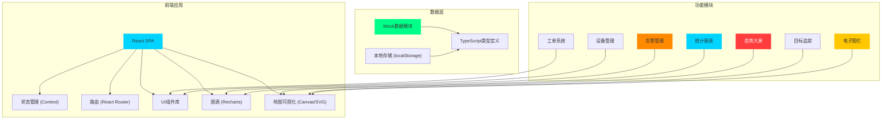
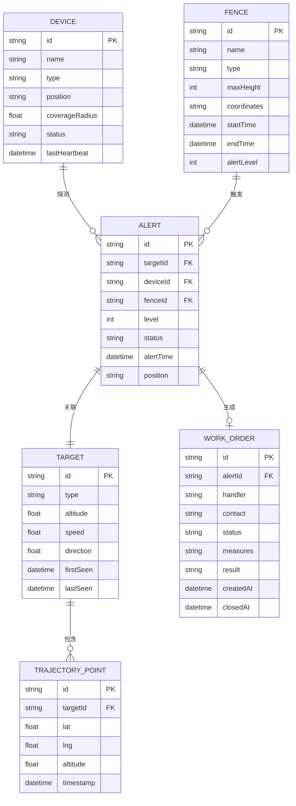

## 1. 架构设计



## 2. 技术描述

- **前端框架**：React 18 + TypeScript 5
- **构建工具**：Vite 5
- **样式方案**：TailwindCSS 3.0 + CSS变量
- **路由管理**：React Router v6
- **图表库**：Recharts 2
- **图标**：Lucide React
- **状态管理**：React Context + useReducer
- **地图可视化**：原生Canvas API + SVG（无需第三方地图SDK，内置园区地图）
- **数据方案**：Mock数据 + localStorage持久化，无需后端服务

## 3. 路由定义

| 路由路径 | 页面名称 | 说明 |
|---------|---------|------|
| / | 态势大屏 | 默认首页，实时监控主界面 |
| /dashboard | 态势大屏 | 实时监控主界面 |
| /alerts | 告警列表 | 告警信息管理 |
| /targets/:id | 目标详情 | 单个目标详细信息 |
| /fence | 电子围栏 | 围栏配置管理 |
| /workorders | 处置工单 | 工单列表与管理 |
| /workorders/:id | 工单详情 | 工单详情与处置 |
| /devices | 设备管理 | 探测器设备管理 |
| /statistics | 统计报表 | 数据统计与报告导出 |

## 4. 数据模型

### 4.1 数据模型定义



### 4.2 TypeScript 类型定义

```typescript
// 告警等级
type AlertLevel = 1 | 2 | 3;

// 告警状态
type AlertStatus = 'pending' | 'confirmed' | 'false_positive' | 'escalated' | 'resolved';

// 围栏类型
type FenceType = 'forbidden' | 'height_limit' | 'temporary';

// 设备状态
type DeviceStatus = 'online' | 'offline' | 'fault';

// 工单状态
type WorkOrderStatus = 'pending' | 'processing' | 'completed' | 'closed';

// 目标信息
interface Target {
  id: string;
  type: string;
  altitude: number;
  speed: number;
  direction: number;
  firstSeen: Date;
  lastSeen: Date;
  trajectory: TrajectoryPoint[];
}

// 轨迹点
interface TrajectoryPoint {
  lat: number;
  lng: number;
  altitude: number;
  timestamp: Date;
}

// 告警信息
interface Alert {
  id: string;
  targetId: string;
  deviceId: string;
  fenceId: string;
  level: AlertLevel;
  status: AlertStatus;
  alertTime: Date;
  position: { lat: number; lng: number };
  description: string;
}

// 电子围栏
interface Fence {
  id: string;
  name: string;
  type: FenceType;
  maxHeight: number;
  coordinates: { lat: number; lng: number }[];
  startTime?: Date;
  endTime?: Date;
  alertLevel: AlertLevel;
}

// 探测设备
interface Device {
  id: string;
  name: string;
  type: 'radar' | 'telemetry' | 'photoelectric';
  position: { lat: number; lng: number };
  coverageRadius: number;
  status: DeviceStatus;
  lastHeartbeat: Date;
}

// 处置工单
interface WorkOrder {
  id: string;
  alertId: string;
  handler: string;
  contact: string;
  status: WorkOrderStatus;
  measures: {
    check?: string;
    announcement?: string;
    intercept?: string;
  };
  result: string;
  createdAt: Date;
  closedAt?: Date;
}
```

## 5. 目录结构

```
src/
├── components/          # 公共组件
│   ├── Layout/         # 布局组件
│   ├── Map/            # 地图相关组件
│   ├── Charts/         # 图表组件
│   └── ui/             # 基础UI组件
├── pages/              # 页面组件
│   ├── Dashboard/      # 态势大屏
│   ├── Alerts/         # 告警列表
│   ├── TargetDetail/   # 目标详情
│   ├── Fence/          # 电子围栏
│   ├── WorkOrders/     # 处置工单
│   ├── Devices/        # 设备管理
│   └── Statistics/     # 统计报表
├── contexts/           # React Context
├── hooks/              # 自定义Hooks
├── data/               # Mock数据
├── types/              # TypeScript类型定义
├── utils/              # 工具函数
├── App.tsx
├── main.tsx
└── index.css
```

## 6. 前端架构要点

1. **状态分层**：全局状态（用户、设备列表、围栏列表）用Context，页面局部状态用useState/useReducer
2. **地图渲染**：使用Canvas绘制园区底图、围栏、设备覆盖范围、目标轨迹等，性能优先
3. **实时模拟**：使用requestAnimationFrame实现目标位置动态更新，模拟实时探测效果
4. **数据持久化**：围栏配置、告警记录、工单数据使用localStorage存储
5. **视觉效果**：使用CSS变量控制主题色，box-shadow实现发光效果，keyframes实现动画
